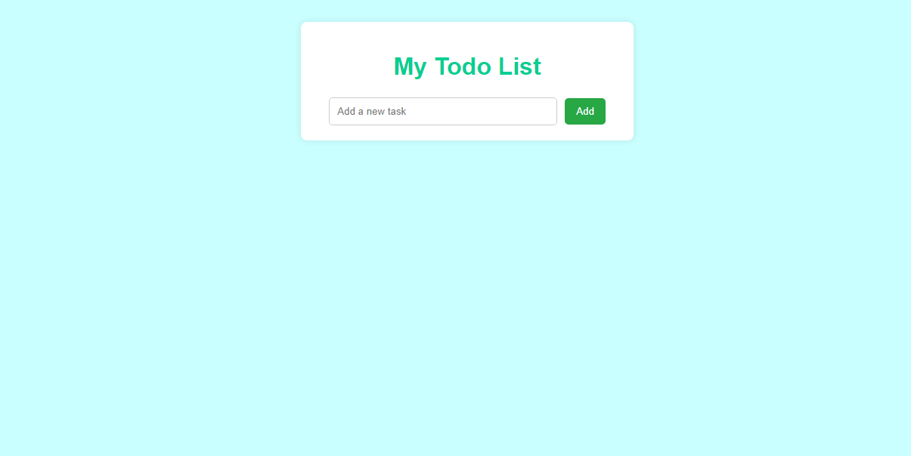
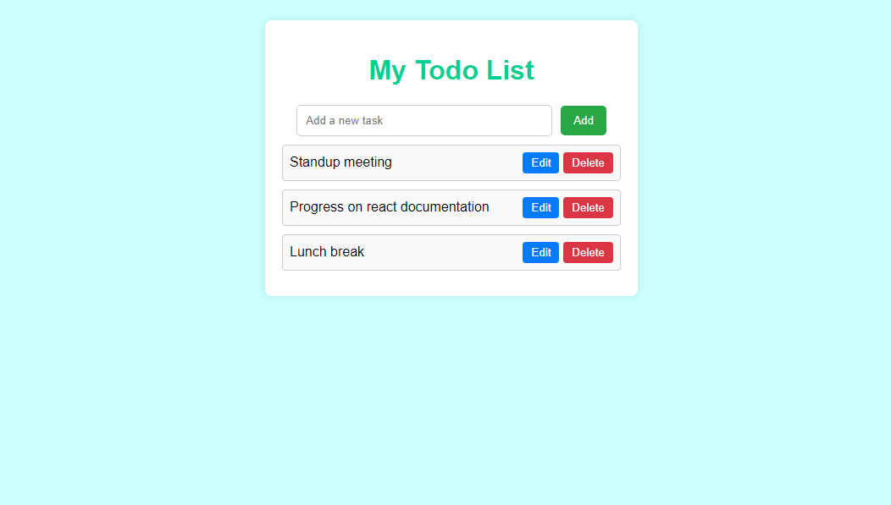
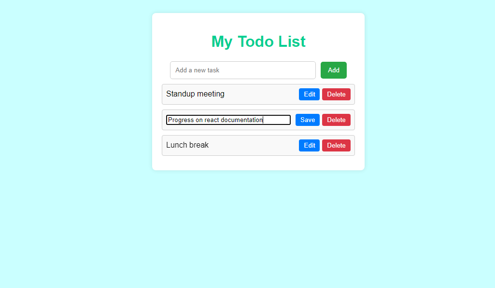
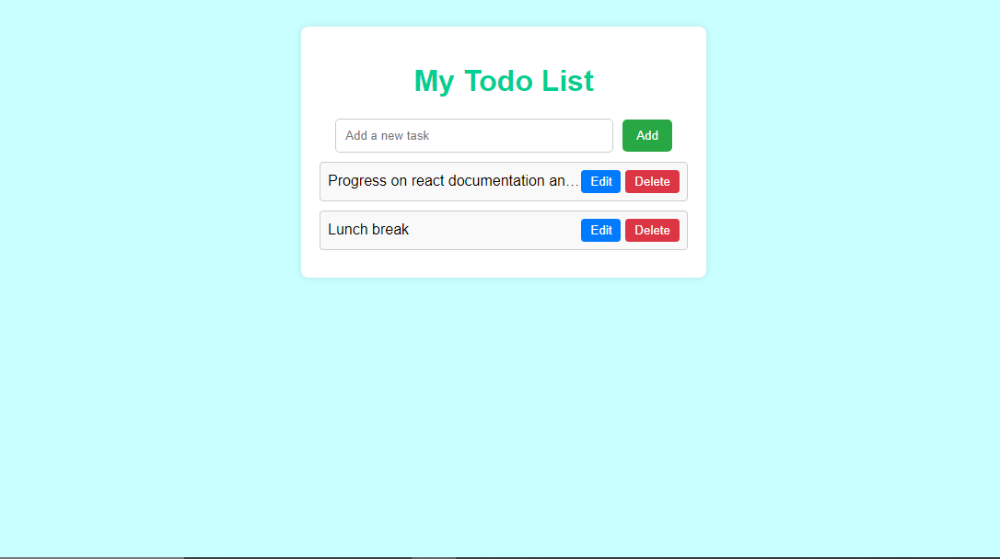

# todo-with-typescript-task2
# Todo List Application

This is a simple Todo List application built with HTML, CSS, and TypeScript.

## Features

- Add tasks to the list
- Edit tasks by clicking the edit button
- Remove tasks by clicking the delete button

## Instructions for Running

1. Clone the repository or download the project files.
2. Compile the TypeScript file to JavaScript using the command: `tsc todo.ts --outFile todo.js`
3. Open `index.html` in your web browser to view and use the Todo List application.

## Project Structure

- `index.html`: The main HTML file containing the structure of the Todo List application.
- `styles/style.css`: The CSS file containing the styles for the Todo List application.
- `scripts/todo.ts`: The TypeScript file containing the logic for adding, editing, and removing tasks.
- `scripts/todo.js`: The JavaScript file compiled from the TypeScript file.

## Screenshot

Add new todo task by typing over the input field.

List of tasks will be displayed under the input field.

To edit a task, press the edit button and save changes.

Press delete button to remove a task from the todo list.

